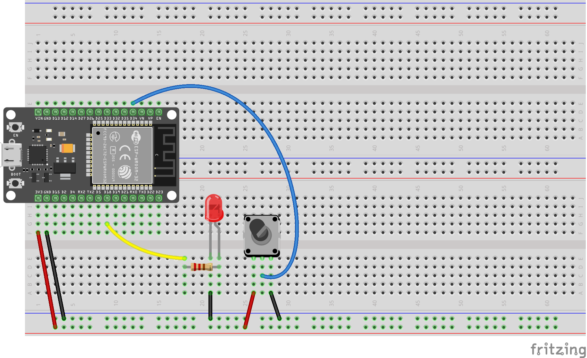

# Brug `millis()` til at blinke med lysdiode, styret med potentiometer

Her skal vi bruge funktionen `millis()`til at styre hvor lang tid (i millisecundser) der går før vi tænder eller slukker lysdioden.
Det kan også være mange andre tilstande, vi tænder eller slukker, natirligvis.

Eksemplet bygger videre på eksemplet [pot_blink](../pot_blink).

I __pot_blink__ brugte vi `delay(blinkDelay)` til at styre hvor lang pause der skal være efter skift til tænd og skift til sluk.

```c++
    digitalWrite(LED_PIN, HIGH);                             // turn the LED on (HIGH is the voltage level)
    Serial.println("LED ON");                                // Print a message to the serial monitor

    delay(blinkDelay);                                       // wait for a the number of miliseconds in blinkDelay
   
    digitalWrite(LED_PIN, LOW);                              // turn the LED off by making the voltage LOW
    Serial.println("LED OFF");                               // Print a message to the serial monitor
    
    delay(blinkDelay);                                       // wait for a the number of miliseconds in blinkDelay
```

Nu skal vi bygge de med en variabel og en if-sætning

<!-- 

Her er ideen at; når man drejer på potentiometret, varieres den forsinkelse der er mellem tænd og sluk, og tænd igen.

Potentiometret er en valiabel modstand, så når vi sætter spænding henover, varieres spendingen på potentiometrets midterste ben.
Denne spænding fører vi ind i en af de porte der kan modtage analoge (variede) spændinger, og konvertere dem til digitale værdier.

Jeg har valg __D34__, ang vi skal huske at initialisere den (i `setup()`) med linjen

```c++
...

#define POT_PIN 34 // Define the POT_PIN pin number

void setup()
{
    ...

    // initialize POT_PIN pin as an input.
    pinMode(POT_PIN, INPUT);

    ...
}
```

Så kan vi aflæse et tal mellem 0 og 4095 (det er nok forskelligt på forskellige CPU'ER)

I funktionen `loop()`:

```c++
// Read the value from the potentiometer
int potValue = analogRead(POT_PIN); 
```

Her bruges `map()` til at konvertere værdien til et tal i et mere brugbart interval.
Det er noget helt andet end map i map/reduce, som vi bruger i big data. \

$$
map(x) = \frac{482}{4095} \cdot x + 30
$$

Mere generelt, kan funktionen også tage max og minimum for både x og y:

$$

\text{map}(x, x_{\text{min}}, x_{\text{max}}, y_{\text{min}}, y_{\text{max}}) = 
\left( \frac{y_{\text{max}} - y_{\text{min}}}{x_{\text{max}} - x_{\text{min}}} \right) \cdot (x - x_{\text{min}}) + y_{\text{min}}

$$

```c++
// Map the potentiometer value to a range of 32 to 512
int blinkDelay = map(potValue, 0, 4095, 30, 512); 
```   -->



Se også [main.cpp](src/main.cpp)